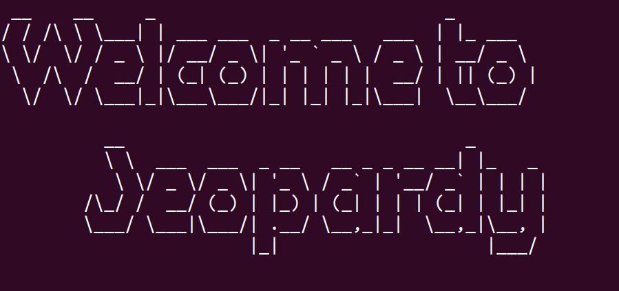

# Jeopardy Py Game

## Project Description

A jeopardy game in a 4 by 4 dimensional trivial game. Includes 4 topics related to GenOne, python, linux, and career related topics/facts. These are sectioned from 100-400 level from easiest to hard. The goal is to make it a collaborative and interactive project for any class to participate in.

### Getting Started

These instructions will get you a copy of the project up and running on your local machine for development and testing purposes.
git clone “url”
Run the main.py file
Select the option

### Prerequisites

There are no additional installation of packages or libraries required for this project. However, Python 3 must be installed in order to run this program. To add

<<<<<<< HEAD

=======
>>>>>>> 1e711683c38cb627414431997851ceef9fef46b7

